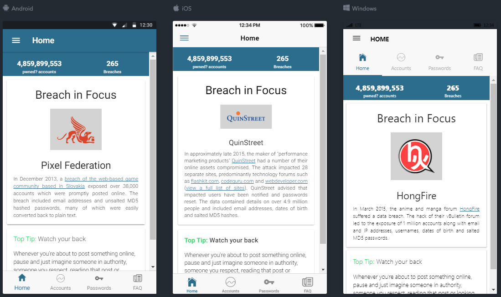

# Pwned?- Public Release

Pwned? An app to allow you to search to see if your email address has been compromised, powered by [Have I Been Pwned?](https://haveibeenpwned.com/).

## Table of Contents

- [License](#license)
- [Getting Started](#getting-started)
- [App Preview](#app-preview)
- [Deploying](#deploying)
- [Misc](#misc)

## License

Pwned? app has been released under [GNU General Public License (v3)](https://www.gnu.org/licenses/gpl-3.0.en.html) license to promote open source app development. Simply, use freely but make your software accessible to others.

## Getting Started

* [Download the installer](https://nodejs.org/) for Node.js.
* Install the ionic CLI globally: `npm install -g ionic` (life saver)
* Clone this repository: `git clone https://github.com/DrDanL/pwned-app-public.git`.
* Run `npm install` from the project root.
* Run `ionic serve` in a terminal from the project root.
* Enjoy. :beers:

_Note: You may need to add “sudo” in front of any global commands to install the utilities._

## App Preview

[Try it live](https://drdanl.github.io/pwned-app-public/www)

All app preview screenshots were taken by running `ionic serve --l`.

- Accounts Page

  

- Home Page

  

- To see more images of the app, check out the [screenshots directory](https://github.com/DrDanL/pwned-app-public/tree/master/resources/screenshots)!

## Deploying

* PWA - run `npm run ionic:build --prod` and then push the `www` folder to your favorite hosting service
* Android - Run `ionic cordova run android --prod`
* iOS - Run `ionic cordova run ios --prod`

## Misc.

This app is under development, future features will include firebase interaction and wifi connectivity status detection.
